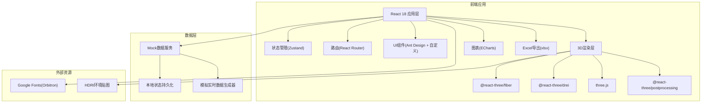
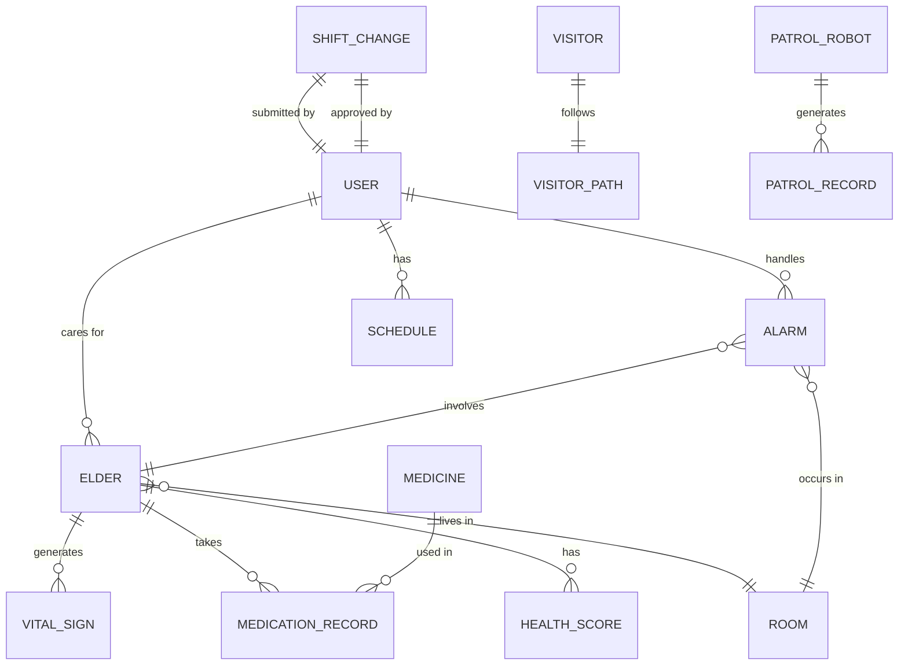

## 1. 架构设计



## 2. 技术说明

- **前端框架**: React@18 + TypeScript + Vite@5
- **3D引擎**: three@0.160 + @react-three/fiber@8 + @react-three/drei@9 + @react-three/postprocessing@2
- **UI组件库**: antd@5（精简使用，主要作为弹窗、表单基础组件）
- **样式方案**: tailwindcss@3 + CSS Modules + 自定义CSS变量主题
- **状态管理**: zustand@4（轻量级状态管理，避免Redux繁琐）
- **图表库**: echarts@5 + echarts-for-react@3
- **Excel导出**: xlsx@0.18
- **路由**: react-router-dom@6
- **数据方案**: 全量Mock数据，内置数据生成器模拟实时心率、血氧等数据变化

## 3. 路由定义

| 路由路径 | 页面组件 | 功能说明 |
|----------|----------|----------|
| `/login` | LoginPage | 人脸识别登录页，角色选择 |
| `/dashboard` | DashboardPage | 3D运营总览主页面 |
| `/dashboard/elder/:id` | DashboardPage(ElderDetailModal) | 老人健康详情弹窗 |
| `/dashboard/alarms` | DashboardPage(AlarmPanel) | 告警列表面板 |
| `/dashboard/schedule` | DashboardPage(SchedulePanel) | 护工排班管理面板 |
| `/dashboard/pharmacy` | DashboardPage(PharmacyPanel) | 药品管理面板 |
| `/dashboard/visitors` | DashboardPage(VisitorPanel) | 访客管理面板 |
| `/dashboard/reports` | DashboardPage(ReportPanel) | 运营报表与导出面板 |

## 4. 状态管理设计（Zustand Store）

```typescript
// 全局应用状态
interface AppState {
  // 用户信息
  currentUser: User | null;
  login: (user: User) => void;
  logout: () => void;
  
  // 3D场景状态
  selectedElderId: string | null;
  activeAlarmIds: string[];
  evacuationMode: boolean;
  visitorPath: VisitorPath | null;
  
  // 业务数据
  elders: Elder[];
  caregivers: Caregiver[];
  alarms: Alarm[];
  schedules: Schedule[];
  medicines: Medicine[];
  visitors: Visitor[];
  patrolRobots: PatrolRobot[];
  rooms: Room[];
  
  // 操作方法
  selectElder: (id: string | null) => void;
  triggerAlarm: (alarm: Alarm) => void;
  handleAlarm: (alarmId: string, handlerId: string) => void;
  toggleEvacuationMode: () => void;
  updateElderVitals: () => void;
  submitShiftChange: (request: ShiftChangeRequest) => void;
  approveShiftChange: (requestId: string, approverRole: Role) => void;
  requestRefill: (medicineId: string) => void;
  approveVisitor: (visitorId: string) => void;
  exportDailyReport: (date: string) => Blob;
}
```

## 5. 核心数据模型

### 5.1 ER图



### 5.2 核心类型定义

```typescript
type Role = 'caregiver' | 'head_nurse' | 'director';

interface User {
  id: string;
  name: string;
  role: Role;
  avatar: string;
  faceFeature: string; // 人脸识别特征向量(模拟)
  department: string;
}

interface Elder {
  id: string;
  name: string;
  age: number;
  gender: 'male' | 'female';
  careLevel: 'self' | 'semi' | 'full'; // 自理/半自理/全护理
  roomId: string;
  position: { x: number; y: number; z: number };
  heartRate: number;
  bloodOxygen: number;
  activityLevel: number; // 0-100 活动量
  sleepQuality: number; // 0-100 睡眠质量
  healthScore: number;
  vitalHistory: VitalSign[];
  medications: MedicationRecord[];
}

interface VitalSign {
  timestamp: number;
  heartRate: number;
  bloodOxygen: number;
}

interface MedicationRecord {
  id: string;
  medicineName: string;
  dosage: string;
  time: string;
  taken: boolean;
}

interface Room {
  id: string;
  name: string;
  type: 'bedroom' | 'activity' | 'nursing' | 'dining' | 'pharmacy' | 'monitor' | 'garden';
  position: { x: number; y: number; z: number; w: number; h: number; d: number };
  occupancy: number;
  capacity: number;
  isAlerting: boolean;
}

interface Alarm {
  id: string;
  type: 'heart_rate' | 'fall' | 'medicine' | 'patrol';
  level: 'low' | 'medium' | 'high' | 'critical';
  elderId?: string;
  roomId: string;
  timestamp: number;
  status: 'pending' | 'handling' | 'resolved';
  handlerId?: string;
  message: string;
}

interface Schedule {
  id: string;
  caregiverId: string;
  date: string;
  shift: 'morning' | 'afternoon' | 'night';
  area: string;
}

interface ShiftChangeRequest {
  id: string;
  applicantId: string;
  originalScheduleId: string;
  targetDate: string;
  targetShift: string;
  reason: string;
  status: 'pending_head' | 'pending_director' | 'approved' | 'rejected';
  headNurseApproved?: boolean;
  directorApproved?: boolean;
}

interface Medicine {
  id: string;
  name: string;
  dosage: string;
  remainingDays: number;
  nextDoseTime: string;
  position: { x: number; y: number; z: number };
  refillRequested: boolean;
}

interface Visitor {
  id: string;
  name: string;
  phone: string;
  visitDate: string;
  visitElderId: string;
  status: 'pending' | 'approved' | 'rejected' | 'completed';
  approvedBy?: string;
}

interface PatrolRobot {
  id: string;
  name: string;
  position: { x: number; y: number; z: number };
  currentRoute: string;
  status: 'patrolling' | 'charging' | 'alert';
  battery: number;
}
```

## 6. 目录结构设计

```
src/
├── assets/                 # 静态资源
│   ├── fonts/             # 字体文件
│   ├── textures/          # 3D纹理贴图
│   └── images/            # 图片资源
├── components/            # 通用UI组件
│   ├── ui/               # 基础UI组件(按钮、卡片等)
│   ├── layout/           # 布局组件
│   └── common/           # 业务通用组件
├── three/                 # 3D场景相关组件
│   ├── Scene.tsx         # 3D场景入口
│   ├── Building.tsx      # 养老院建筑
│   ├── rooms/            # 各区域房间组件
│   ├── Elder.tsx         # 老人3D模型
│   ├── Caregiver.tsx     # 护工3D模型
│   ├── Robot.tsx         # 巡更机器人
│   ├── HealthLabel.tsx   # 健康数据悬浮标签
│   ├── AlarmEffect.tsx   # 告警闪烁效果
│   ├── PathLine.tsx      # 路径指引线
│   └── MedicineBox.tsx   # 药盒3D模型
├── pages/                 # 页面组件
│   ├── LoginPage.tsx
│   └── DashboardPage.tsx
├── panels/                # Dashboard子面板
│   ├── ElderDetailPanel.tsx
│   ├── AlarmPanel.tsx
│   ├── SchedulePanel.tsx
│   ├── PharmacyPanel.tsx
│   ├── VisitorPanel.tsx
│   └── ReportPanel.tsx
├── store/                 # 状态管理
│   └── useAppStore.ts
├── data/                  # Mock数据与生成器
│   ├── mockData.ts
│   └── dataGenerator.ts
├── hooks/                 # 自定义Hooks
│   ├── useRealTimeData.ts
│   └── usePermissions.ts
├── utils/                 # 工具函数
│   ├── excelExport.ts
│   ├── healthScore.ts
│   └── pathfinding.ts
├── styles/                # 全局样式
│   ├── globals.css
│   └── theme.css
├── types/                 # TypeScript类型定义
│   └── index.ts
├── App.tsx
├── main.tsx
└── vite-env.d.ts
```
