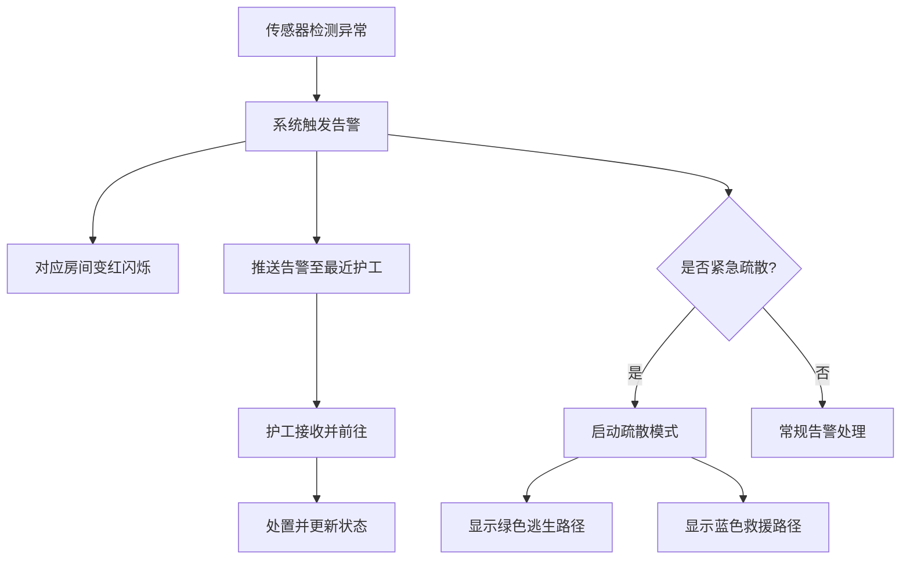
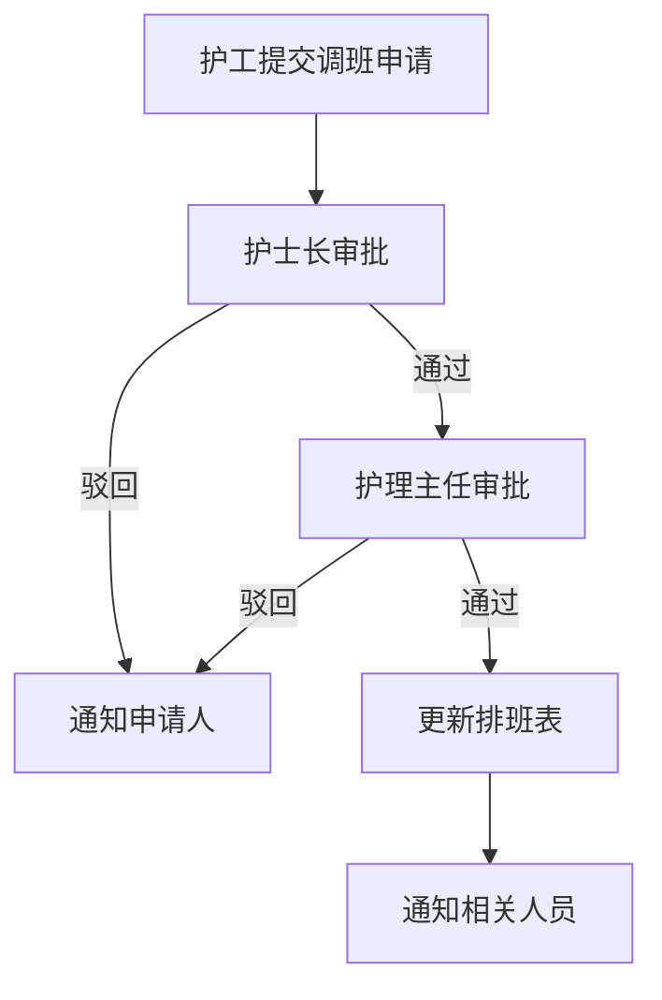

## 1. 产品概述

3D智慧养老院综合运营与应急调度可视化平台，通过三维可视化技术整合养老院的人员管理、健康监测、护理调度、药品管理、安防应急等核心业务模块，实现全场景数字化运营管理。

- 面向养老院院长、护士长、护工三级角色，提供差异化权限与功能
- 解决传统养老院管理信息化程度低、应急响应慢、健康数据分散的痛点
- 通过3D沉浸式交互提升运营效率与服务质量，打造智慧养老标杆

---

## 2. 核心功能

### 2.1 用户角色

| 角色 | 登录方式 | 核心权限 |
|------|----------|----------|
| 护工 | 人脸识别 | 查看负责区域老人信息、处理告警、执行巡更、提交调班申请 |
| 护士长 | 人脸识别 | 审批调班申请、管理护理方案、查看全区域数据、处理告警 |
| 院长 | 人脸识别 | 全局运营监控、审批终审、导出日报、系统配置管理 |

### 2.2 功能模块

1. **登录页**: 人脸识别登录、角色选择
2. **3D运营总览**: 养老院全景3D场景、区域切换、实时数据看板
3. **老人健康管理**: 老人3D模型、实时健康数据、24小时趋势曲线、用药记录、健康评分
4. **告警与应急调度**: 心率异常告警、跌倒检测告警、房间闪烁告警、护工终端推送、一键疏散
5. **护工排班管理**: 自动排班、护理强度计算、在线调班申请、二级审批流程
6. **药品管理**: 药盒可视化、剩余量预警、自动补药申请、服药提醒
7. **访客管理**: 在线预约、审批流程、3D路径指引
8. **安防监控**: 夜间巡更机器人、异常检测拍摄上传、紧急疏散路径
9. **运营报表**: 入住率统计、健康事件统计、排班统计、Excel日报导出

### 2.3 页面详情

| 页面名称 | 模块名称 | 功能描述 |
|----------|----------|----------|
| 登录页 | 人脸识别区域 | 摄像头捕捉人脸、身份识别、角色自动匹配 |
| 登录页 | 角色切换 | 手动选择角色、密码备选登录 |
| 3D运营总览 | 3D场景区 | 养老院建筑全景、各区域可点击进入、老人/护工/机器人实时位置 |
| 3D运营总览 | 顶部数据看板 | 入住率、在院人数、今日告警、健康评分均值、在班护工数 |
| 3D运营总览 | 侧边导航栏 | 功能模块入口、用户信息、退出登录 |
| 老人健康管理 | 老人详情弹窗 | 24小时心率/血氧趋势图、用药记录列表、健康评分、护理等级 |
| 老人健康管理 | 健康数据标签 | 模型头顶悬浮显示姓名/年龄/护理等级/心率/血氧 |
| 告警与应急调度 | 告警列表 | 实时告警队列、告警类型/级别/位置/处理状态 |
| 告警与应急调度 | 告警处置 | 指派护工、标记处理、一键呼叫、视频查看 |
| 告警与应急调度 | 疏散模式 | 绿色逃生路径、蓝色救援路径、人员位置实时更新 |
| 护工排班管理 | 排班日历 | 周视图排班表、各区域护理强度热力图 |
| 护工排班管理 | 调班审批 | 调班申请列表、护士长审批、护理主任终审 |
| 药品管理 | 药房3D视图 | 药盒3D模型、品名/剂量/剩余量/下次服药时间显示 |
| 药品管理 | 补药申请 | 自动生成补药单、审批状态跟踪 |
| 访客管理 | 预约列表 | 访客预约申请、审批操作、二维码生成 |
| 访客管理 | 3D路径指引 | 访客位置起点到目的地动态路径绘制 |
| 安防监控 | 机器人监控 | 巡更路线显示、实时画面、异常事件记录 |
| 运营报表 | 数据统计 | 各区域入住率、健康事件分类统计、护工出勤统计 |
| 运营报表 | Excel导出 | 按日期选择、一键导出运营日报 |

---

## 3. 核心流程

### 3.1 告警应急响应流程

护工登录系统后，3D场景实时展示在院老人状态。当老人心率异常或跌倒检测触发时，对应房间变红闪烁并自动推送告警到最近护工终端。护工接收告警后前往处置，系统同步记录处理过程。若紧急情况启动一键疏散，3D场景显示绿色逃生路径和蓝色救援路径。

### 3.2 调班审批流程

---

## 4. 用户界面设计

### 4.1 设计风格

- **主色调**: 深科技蓝(#0A1628)为背景主色，搭配医疗青(#00D4AA)、警示红(#FF4757)、活力橙(#FFA502)
- **辅助色**: 数据绿(#2ED573)、路径蓝(#1E90FF)、信息紫(#A29BFE)
- **按钮风格**: 圆角胶囊按钮，悬浮发光效果，科技感边框
- **字体**: 标题使用 "Orbitron" 科技感字体，正文使用 "PingFang SC" 优雅中文字体
- **布局风格**: 深色仪表盘风格，3D场景中央展示，四周环绕数据面板，玻璃拟态(Glassmorphism)面板设计
- **图标风格**: 线性描边图标，发光霓虹效果

### 4.2 页面设计概览

| 页面名称 | 模块名称 | UI元素 |
|----------|----------|--------|
| 登录页 | 人脸识别区 | 圆形扫描边框、面部识别动画、渐变光效背景 |
| 3D运营总览 | 3D场景 | 第一人称/俯视视角切换、鼠标拖拽旋转、滚轮缩放、hover高亮 |
| 3D运营总览 | 数据看板 | 半透明玻璃面板、数字跳动动画、环形进度条、微柱状图 |
| 老人健康管理 | 数据标签 | 悬浮3D标签、实时数值闪烁、异常值红色高亮 |
| 老人健康管理 | 趋势曲线 | 平滑曲线图、双Y轴、24小时时间轴、数据点hover提示 |
| 告警与应急调度 | 告警列表 | 左侧滑出面板、级别颜色标识、新告警动画提示 |
| 护工排班管理 | 排班日历 | 周视图时间轴、颜色编码班次、拖拽调班、热力图背景 |
| 药品管理 | 药盒视图 | 3D药盒模型、剩余量进度条、橙色闪烁预警 |
| 运营报表 | 导出面板 | 日期范围选择器、统计卡片、下载按钮动效 |

### 4.3 响应式设计

- 桌面端优先设计，适配1920×1080及以上分辨率
- 侧边栏可折叠，适配不同屏幕宽度
- 3D场景自适应容器尺寸，保持正确纵横比

### 4.4 3D场景指导

- **环境与氛围**: 室内温暖光照(HDRI)，医疗洁净感，柔和阴影，夜景模式切换
- **光照设置**: 主方向光模拟日光 + 区域补光 + 各房间点光源，动态阴影
- **相机设置**: 初始俯视45°角，支持轨道控制器(OrbitControls)，限制俯仰角度避免穿模
- **构图与焦点**: 养老院建筑位于场景中央，各功能区域围绕分布，老人/护工模型动态分布
- **交互与动画**: 房间可点击高亮、老人模型呼吸动画、护工行走动画、机器人巡更移动、告警闪烁动画、路径流光动画
- **后处理效果**: Bloom泛光效果、SSAO环境光遮蔽、轻微色差、色调映射
- **性能预算**: 模型面数控制在合理范围，使用实例化渲染(InstancedMesh)优化重复物体，LOD层级细节
